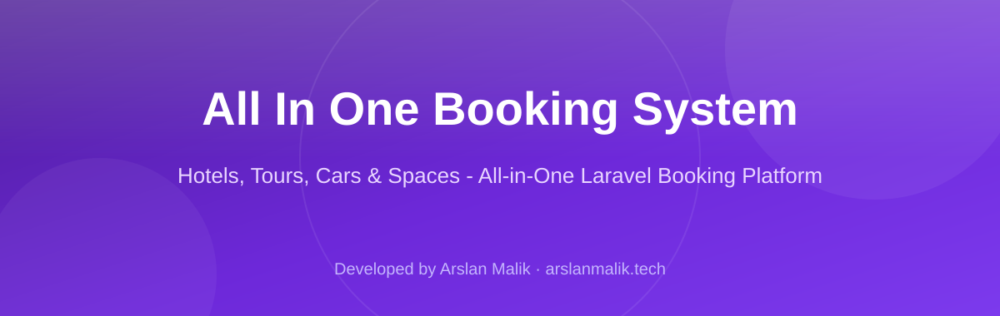
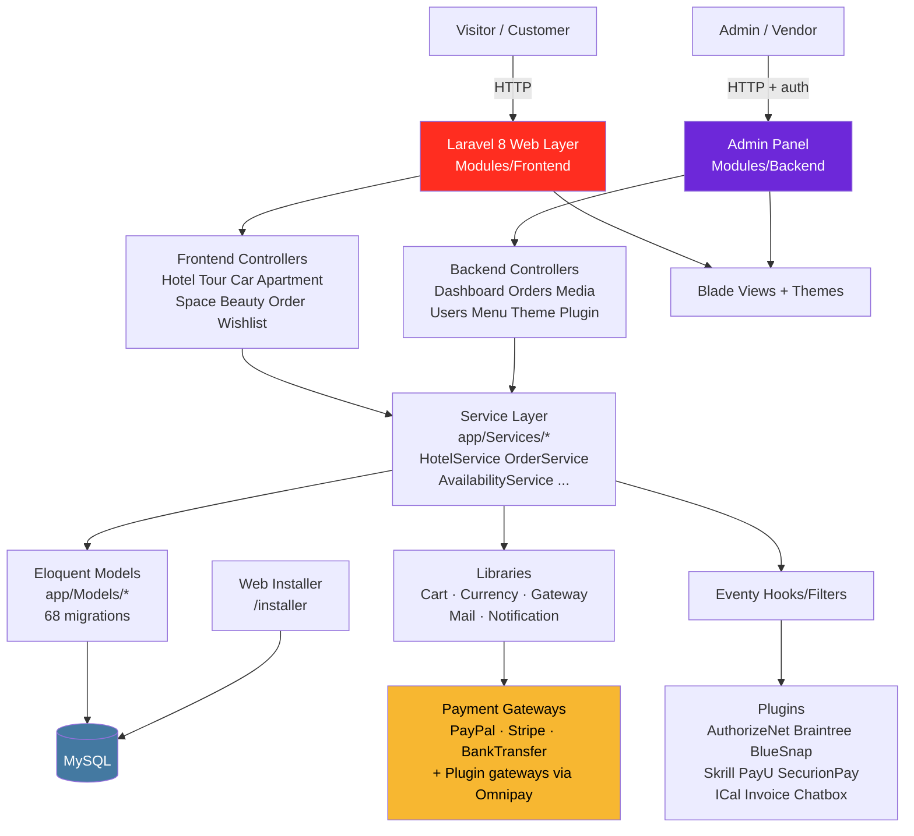

<p align="center"></p>

<p align="center">
  
  
  
  
  
</p>

> **Developed by [Arslan Malik](https://github.com/arsalanmaalik461)**
> 📱 WhatsApp: [+92 300 8987448](https://wa.me/923008987448) · 🌐 Website: [arslanmalik.tech](https://arslanmalik.tech)

---

## 🌟 Executive Overview

**All In One Booking System** is a full-featured, modular booking platform built on **Laravel 8** and **PHP 7.4+**. Instead of being a single-purpose script, it ships as one codebase that can sell and manage reservations across six service verticals — hotels & rooms, tours, cars, apartments, event spaces, and beauty/salon services — each with its own search, detail pages, availability calendars, and real-time price calculation.

Under the hood it follows a clean modular architecture: `app/Modules/Frontend` and `app/Modules/Backend` separate the customer-facing site from the admin panel, while a service layer (`app/Services/*`) keeps business logic out of the controllers. Checkout runs through a pluggable gateway system (`app/Gateways` + `app/Plugins`) with PayPal, Stripe, and bank transfer built in, plus optional plugin gateways for AuthorizeNet, Braintree, BlueSnap, Skrill, PayU, and SecurionPay. A hook/filter system (via `tormjens/eventy`) lets plugins extend behavior without touching core code.

Beyond bookings, the system is a complete CMS and marketplace toolkit: a vendor/partner program with earnings tracking and withdrawal requests, coupons, wishlists, reviews/comments, a media manager, menu builder, theme engine, multi-language support, SEO tools with auto-generated sitemaps, and an 8-step web installer (`/installer`) that configures the database and seeds initial data.

---

## 📑 Table of Contents

- [✨ Key Features & Highlights](#-key-features--highlights)
- [🖥️ Feature Showcase](#️-feature-showcase)
- [🏗️ System Architecture](#️-system-architecture)
- [🚀 Quickstart & Installation Guide](#-quickstart--installation-guide)
- [📂 Project Structure](#-project-structure)
- [🛡️ Security & Notes](#️-security--notes)

---

## ✨ Key Features & Highlights

| Feature | Description |
| :--- | :--- |
| 🏨 Multi-vertical booking engine | Hotels (+ rooms), Tours, Cars, Apartments, Spaces, and Beauty services — each with search, detail pages, and cart-based checkout |
| 📅 Availability calendars | Per-service availability management with date-based pricing via `AvailabilityController` and `*Availability` models |
| 💳 Pluggable payment gateways | PayPal, Stripe, and Bank Transfer built in (Omnipay); plugin gateways: AuthorizeNet, Braintree, BlueSnap, Skrill, PayU, SecurionPay |
| 🤝 Vendor / partner program | "Become a partner" flow — vendors manage listings, track earnings (`EarningsReportService`), and request withdrawals |
| 🎟️ Coupons & wishlists | Discount coupon codes applied at checkout; customer wishlists across all service types |
| ⭐ Reviews & comments | Comment/review system per listing with backend moderation |
| 🌍 Multi-language | Language manager with locale middleware (`config/locales.php`) |
| 🖼️ Media manager | Built-in media library with upload, detail, and bulk-delete actions |
| 🧩 Plugin system | Eventy hook/filter architecture; console commands to scaffold plugins, themes, and iCal feeds |
| 🎨 Theme engine | Theme management in the admin panel with pluggable theme views |
| 🔍 SEO toolkit | SEO settings per page/service, auto-generated `sitemap.xml` / `sitemap-{service}.xml`, and `robots.txt` routes |
| 🔐 Social login | OAuth login via Laravel Socialite (`/auth/redirect/{provider}`) |
| 🧾 Invoice plugin | Built-in Invoice plugin for order invoicing |
| 💬 Chatbox plugin | Built-in Chatbox plugin for customer messaging |
| 📆 iCal plugin | iCal import/export support for availability sync |
| 🧰 Web installer | Step-by-step browser installer (`/installer`) — database config, data import, and setup without touching the terminal |
| 📝 CMS built in | Pages, blog posts, categories, tags, menus, and a contact page — a full site without a separate CMS |

---

## 🖥️ Feature Showcase

### 1. Six booking verticals in one codebase

> "One platform, every reservation type — hotels, tours, cars, apartments, spaces, and salon services."

- Each vertical gets dedicated frontend controllers, search views, detail pages, and enquiry forms (e.g. `hotel-search`, `car/{slug}`, `apartment-send-enquiry`)
- Room-level booking inside hotels (`RoomController`: search, detail, real-time pricing)
- Availability calendars and per-date pricing fetched live (`fetch-calendar-availability`, `get-real-price`)
- Cart library (`app/Libraries/Cart.php`) unifies the checkout flow across all service types

### 2. Vendor marketplace with earnings & payouts

> "Let partners sell on your platform — and pay them out, all inside the admin panel."

- Public "Become a Partner" registration flow with admin approval (`becomeAPartnerAction`)
- `AgentController` / `AgentService` plus `AgentAvailability` models for vendor-managed listings
- Earnings reports per vendor (`EarningsReportController`, `EarningsReportService`)
- Withdrawal requests with backend review (`WithdrawalController`, `WithdrawalService`)

### 3. Payments, coupons, and order lifecycle

> "Checkout that adapts — multiple gateways, discount codes, and full order tracking."

- Gateway abstraction (`app/Gateways/BaseGateway.php`) with PayPal, Stripe, and Bank Transfer implementations on top of Omnipay
- Extra gateways ship as plugins: AuthorizeNet, Braintree, BlueSnap, Skrill, PayU, SecurionPay, and a manual SubmitForm gateway
- Coupon apply/remove at checkout (`CouponController`), multi-currency support (`app/Libraries/Currency.php`)
- Order flow: `checkout` → `payment-checking` → `complete-order`, with backend order management per service type

### 4. Admin CMS, themes, and plugin platform

> "Run the whole site from one dashboard — content, design, and extensions."

- Dashboard with settings manager (`OptionController`), media library, menu builder, and user/role management
- Posts/blog with categories, tags, comments, trash/restore; pages with the same lifecycle
- Theme engine (`ThemeController`) and plugin manager (`PluginController`) with Artisan scaffolding (`PluginCommand`, `ThemeCommand`, `iCalCommand`)
- Behavior extension via Eventy actions/filters — plugins hook in without core edits
- Multi-language content, SEO meta per entity, and automatic sitemaps

---

## 🏗️ System Architecture



**Request flow:** Browser → module routes (`app/Modules/*/Routes/web.php`, locale + auth middleware) → controller → service → Eloquent model → MySQL. Payments branch through `app/Gateways` (Omnipay drivers), and plugins tap into Eventy hooks. The 8-step web installer handles first-time database setup and seeding.

---

## 🚀 Quickstart & Installation Guide

### Prerequisites

- **PHP** >= 7.4 with extensions: `json`, `mbstring`, `openssl`, `pdo_mysql`, `tokenizer`, `xml`, `ctype`, `fileinfo`, `gd` (image resizing)
- **MySQL** 5.7+ / MariaDB 10.3+
- **Composer** 2.x and **Node.js + npm** (for frontend assets)
- A web server (Apache/Nginx) with the document root pointed at `public/`

### Step-by-Step Installation

```bash
# 1. Clone the repository
git clone https://github.com/arsalanmaalik461/all-in-one-booking-system.git
cd all-in-one-booking-system

# 2. Install PHP dependencies
composer install

# 3. Install JS dependencies and build assets
npm install
npm run prod

# 4. Point your web server / virtual host document root to the public/ directory
#    Example (Apache):  DocumentRoot /path/to/all-in-one-booking-system/public

# 5. Open the web installer in your browser and follow the steps
#    (database connection, admin account, data import)
http://your-domain.test/installer

# 6. (Optional) Run the test suite
php artisan test
# or
./vendor/bin/phpunit
```

**Admin panel:** after installation, visit `http://your-domain.test/admin` (prefix configurable via `admin_config('prefix')`).

**Useful Artisan commands:**

```bash
php artisan plugin:make MyPlugin     # scaffold a new plugin
php artisan theme:make MyTheme       # scaffold a new theme
php artisan ical:make                # iCal-related scaffolding
```

> **Note:** there is no `.env.example` shipped in the repo (it is git-ignored) — the web installer at `/installer` writes your `.env` for you during setup, including the database connection and `APP_KEY`.

---

## 📂 Project Structure

```
all-in-one-booking-system/
├── app/
│   ├── Console/Commands/        # PluginCommand, ThemeCommand, iCalCommand
│   ├── Gateways/                # BaseGateway, Paypal, Stripe, BankTransfer
│   ├── Helpers/                 # booking.php and shared helpers
│   ├── Http/Controllers/Auth/   # Authentication controllers
│   ├── Libraries/               # Cart, Currency, Gateway, Mail, Notification, Assets
│   ├── Mail/                    # Mailable classes (HTML mail via Emogrifier)
│   ├── Models/                  # Eloquent models (Hotel, Tour, Car, Space,
│   │                            #   Apartment, Beauty, Room, Order, Coupon, ...)
│   ├── Modules/
│   │   ├── Backend/             # Admin panel: Config, Controllers, Routes, Views
│   │   ├── Frontend/            # Customer site: Config, Controllers, Routes, Views
│   │   └── ServiceProvider.php  # Module registration
│   ├── Plugins/                 # AuthorizeNet, Braintree, BlueSnap, Skrill,
│   │                            #   PayU, SecurionPay, ICal, Invoice, Chatbox, ...
│   ├── Providers/               # Laravel service providers
│   ├── Repositories/            # Repository layer
│   └── Services/                # Business logic (HotelService, OrderService, ...)
├── bootstrap/                   # Laravel bootstrap
├── config/                      # app, auth, database, locales, mail, ...
├── database/
│   ├── migrations/              # 68 migrations
│   └── seeds/                   # Database seeders
├── docs/assets/                 # Project banner
├── public/                      # Web document root (index.php, built css/js)
├── resources/
│   ├── js/  sass/               # Frontend assets (Laravel Mix)
│   ├── lang/                    # Translation files
│   └── views/                   # Blade views (auth, layouts, home)
├── routes/                      # api.php, web.php, channels.php, console.php
├── storage/                     # Logs, cache, sessions
├── tests/                       # Feature + Unit tests (PHPUnit 9)
├── artisan                      # Artisan CLI
├── composer.json                # PHP deps (Laravel 8, Omnipay, Socialite, ...)
├── package.json                 # JS deps (Laravel Mix build)
├── server.php                   # PHP built-in server router
└── webpack.mix.js               # Asset build definition
```

---

## 🛡️ Security & Notes

- **Environment file:** `.env` is git-ignored — never commit it. Keep `APP_KEY`, database credentials, mail credentials, and gateway API keys (PayPal/Stripe/plugin gateways) only in `.env` on the server.
- **Installer:** the `/installer` route bootstraps the whole site. After installation, make sure it cannot be re-run against a live database (guard or remove access once setup is complete).
- **Admin prefix:** the backend lives under a configurable prefix (`admin_config('prefix')`) — change it from the default for obscurity, and always serve the panel over HTTPS.
- **Uploads:** the media manager accepts file uploads — the production server should validate MIME types/sizes and serve `storage`/`public` uploads without script execution.
- **Dependencies:** `composer.lock` is git-ignored in this repo, so run `composer install` from a known-good state and keep `laravel/framework` and Omnipay gateway packages updated for security patches.
- **Payments:** gateway credentials live in config/`services.php` + `.env`; use sandbox/test mode keys while developing and never log raw card data (card processing is handled by the gateway SDKs, not stored locally).
- **License:** the project scaffold declares the MIT license (`composer.json`).

---

<p align="center">
  <sub>Developed with ❤️ by <a href="https://github.com/arsalanmaalik461">Arslan Malik</a> · 📱 <a href="https://wa.me/923008987448">WhatsApp: +92 300 8987448</a> · 🌐 <a href="https://arslanmalik.tech">arslanmalik.tech</a></sub>
</p>
